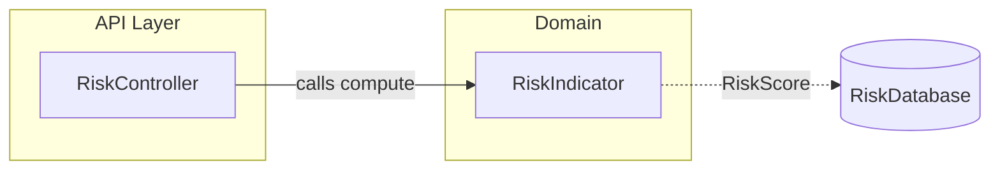

# Mermaid Diagrams

Diagrams replace prose. A reader must understand the depicted structure or flow from the diagram alone.

When this skill is invoked directly with a Markdown file as the argument: validate the file (Section 5), fix every error
and every rule violation from Sections 2-4, and validate again until the script reports no errors.

## 1. Choose the Diagram Type

| Content                | Level | Mermaid type                       | Elements                                            |
|------------------------|-------|------------------------------------|-----------------------------------------------------|
| Structure              | High  | `flowchart` as a component diagram | Components, systems, dependencies, data flow        |
| Structure              | Low   | `classDiagram`                     | Real classes, structs, traits, interfaces, fields   |
| Behavior               | High  | `flowchart`                        | High-level components or steps, one action per box  |
| Behavior               | Low   | `sequenceDiagram`                  | Components as participants, function calls as calls |
| Lifecycle              | Any   | `stateDiagram-v2`                  | Valid states and the events between them            |
| Persistence data model | Any   | `erDiagram`                        | Tables, columns, relations                          |

- A document that changes structure has a structural diagram. A document that changes behavior has a behavioral
  diagram.
- Every section that describes a workflow, process, or multi-step interaction has a diagram. A prose-only description
  of a multi-step process is incomplete.
- Prefer several small diagrams to one large diagram. Split a diagram that has more than 15 nodes or 20 messages.

## 2. General Rules

- Use the exact technical names from the code, or the names the code will use: `UserDatabase`, `compute()`. Do not use
  generic names such as "Service A" unless that is the real abstraction level.
- Put a heading or a one-sentence caption directly above each diagram that states what it depicts.
- A label or note has at most 1 sentence. Labels add information the shapes do not show: data element names, conditions,
  protocols.
- Do not re-tell the diagram in prose.
- Do not add colors, styles, or `%%{init}%%` themes unless a color encodes meaning. Documents render in light and dark
  themes.

## 3. Rules per Diagram Type

### Component Diagram

Mermaid has no UML component diagram. Use `flowchart` with this notation:

- `subgraph id["Name"]` - a namespace, package, isolated system, or logical group.
- `Name[(Name)]` - a persistence component (database shape).
- `-->` solid arrow - a dependency: the source calls or depends on the target.
- `-.->` dotted arrow - data flow.
- Every arrow has a label.



### Flowchart

- Each box is a high-level component or step that performs one action.
- Each arrow has a label with the name of the data element it passes.
- A decision is a `{}` diamond; each outgoing arrow is labelled with its condition.
- Use `flowchart LR` for pipelines and `flowchart TD` for branching processes.
- Use `subgraph` for software layers or isolated systems.

### Sequence Diagram

- Participants are concrete components that exist or will be implemented. Declare them with `participant` in call
  order. Use `actor` only for people.
- Messages are function calls: `A->>B: compute(input)`. Returns use dotted arrows: `B-->>A: RiskScore`.
- Use `alt`/`else`, `opt`, `loop`, and `par` blocks for branches, optional steps, repetition, and parallel steps.
- Add `autonumber` when prose refers to step numbers.

### Class Diagram

- Show real classes, structs, traits, and interfaces with their real fields and key methods. Omit trivial accessors.
- Use `namespace` blocks for packages or modules.
- Relations: `<|--` inheritance or trait implementation, `*--` composition, `o--` aggregation, `-->` association,
  `..>` dependency. Add multiplicities where they are part of the contract.
- Write generic types with tildes: `List~String~`.

### State Diagram

- Use `stateDiagram-v2`. Use `[*]` for the start and end states.
- Label every transition with the event that triggers it.

### ER Diagram

- Entity and attribute names are the real table and column names.
- Mark keys with `PK` and `FK`. Label every relation with its meaning.

## 4. Syntax Pitfalls

| Pitfall                                              | Broken                       | Fixed                                                                              |
|------------------------------------------------------|------------------------------|------------------------------------------------------------------------------------|
| Parentheses or brackets inside a node label          | `A[compute(x)]`              | `A["compute(x)"]`                                                                  |
| Double quotes inside a quoted label (silent)         | `A["say "hi""]`              | `A["say #quot;hi#quot;"]`                                                          |
| Lowercase `end` as a node id                         | `A --> end`                  | `A --> End`                                                                        |
| Node id starts with `o` or `x` after a link (silent) | `A---oRisk` (draws a circle) | `A--- oRisk` or `A---Risk`                                                         |
| Semicolon in a sequence message                      | `A->>B: save; commit`        | `A->>B: save#59; commit`                                                           |
| Block without `end`                                  | `alt valid` ... (no `end`)   | Close every `subgraph`, `alt`, `opt`, `loop`, `par`, `critical`, `rect` with `end` |
| Angle-bracket generics in a class diagram (silent)   | `List<String> items`         | `List~String~ items`                                                               |
| Edge to a subgraph without an id                     | `subgraph API Layer`         | `subgraph api["API Layer"]`, then `api --> B`                                      |

## 5. Validation

Run the validation script for every document in which you created or changed a diagram:

```bash
bash ~/.claude/skills/mermaid-diagrams/scripts/validate.sh docs/file.md [more files...]
```

- The script renders every ` ```mermaid ` block with Mermaid CLI and prints `file:line` and the parser error for each
  invalid block. Exit code `0` means all diagrams are valid.
- Fix every reported error and run the script again until it exits with `0`. Do not report a diagram as valid without
  running the script.
- If the script cannot run (no Node.js, or no network for the first Mermaid CLI download), check each diagram against
  Section 4 and tell the user that the validation was manual.
- A valid syntax does not make a diagram correct. Check each diagram against the code: the names exist, and the calls
  happen in the depicted order.
- The script detects parse errors only. Pitfalls marked `(silent)` in Section 4 parse successfully but render wrongly;
  check them by reading the diagram source.

## Checklist

- [ ] Each diagram uses the type from Section 1 for its content and level.
- [ ] Each workflow or multi-step process has a diagram.
- [ ] Each diagram has a caption or heading, exact technical names, and labelled arrows.
- [ ] No prose re-tells a diagram.
- [ ] The validation script exits with `0` for every changed document.
