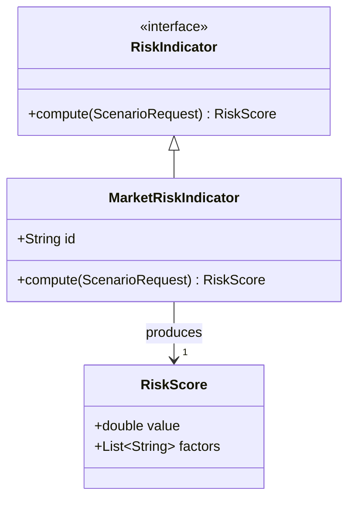

# Class Diagram

Low-level structure: the real classes, structs, traits, and interfaces of the code with their fields and key methods.

- Show real classes, structs, traits, and interfaces with their real fields and key methods. Omit trivial accessors.
- Use `namespace` blocks for packages or modules.
- Relations: `<|--` inheritance or trait implementation, `*--` composition, `o--` aggregation, `-->` association,
  `..>` dependency. Add multiplicities where they are part of the contract.
- Write generic types with tildes: `List~String~`.
- `<<interface>>` and `<<abstract>>` are valid here and render as `«interface»`. This is the one diagram type in which
  `<<>>` works; a flowchart needs guillemets instead (`syntax-pitfalls.md`).

