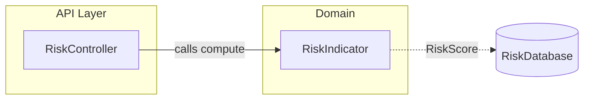

# Component Diagram

High-level structure: components, the systems they belong to, their dependencies, and data flow between them.

Mermaid has no UML component diagram. Use `flowchart` with this notation:

- `subgraph id["Name"]` - a namespace, package, isolated system, or logical group.
- `Name[(Name)]` - a persistence component (database shape).
- `-->` solid arrow - a dependency: the source calls or depends on the target.
- `-.->` dotted arrow - data flow.
- Every arrow has a label.

