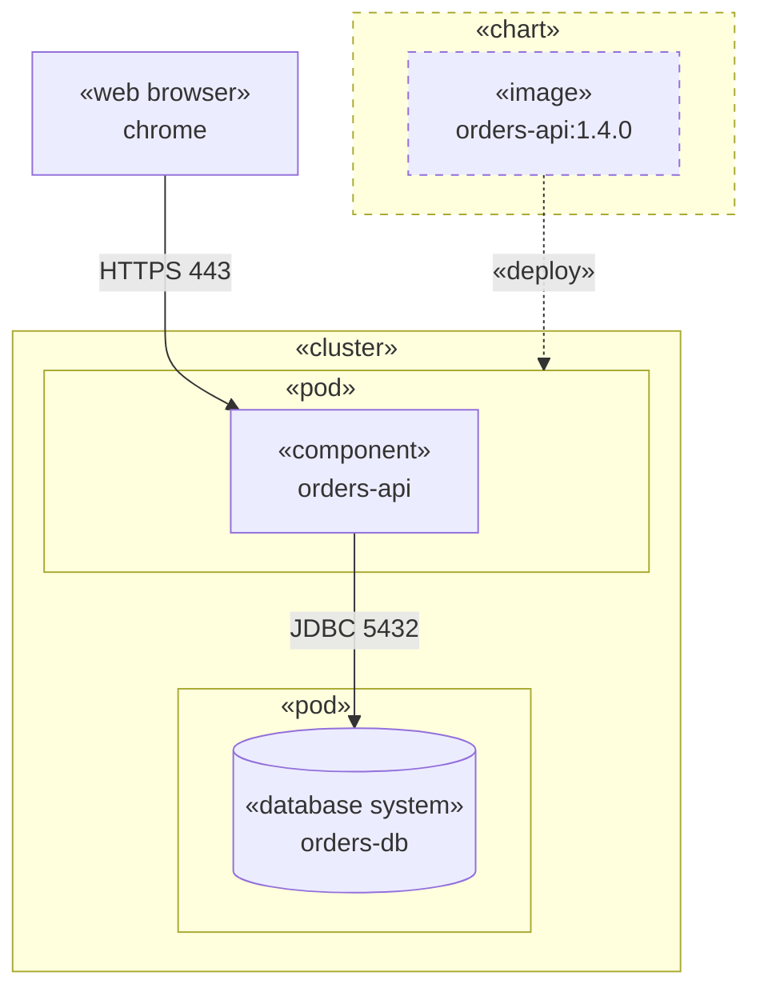

# Deployment Diagram

Where the software runs: clusters, hosts, pods and containers, the units deployed in them, and the connections between
them.

Use `flowchart` with this notation:

- `subgraph id["«pod»<br>orders-pod"]` - a boundary: cluster, host, VM, pod, container, runtime.
- A boundary holds the units deployed in it, one node per component. Nest boundaries to show containment: a container in
  a pod in a cluster.
- `-->` solid arrow - a connection. Its label is the connection type: `HTTPS 443`, `gRPC`, `JDBC 5432`, `AMQP`.
- `-.->` dotted arrow - data flow between components, or a `«deploy»` or `«manifest»` relation.

## Stereotypes

Every boundary and every node carries one stereotype on the first line of its label, with the name on the second line:
`["«component»<br>orders-api"]`. Use guillemets `«»`; `<<component>>` parses but renders empty
(`syntax-pitfalls.md`).

An element is either an instance or a definition, and its stereotype decides which. A pod is an instance; the chart that
produces it is a definition.

**Instances - solid border.** Something that exists at run time and can be reached over a connection:

| Applies to                   | UML keyword              | Narrower stereotypes                                                            |
|------------------------------|--------------------------|---------------------------------------------------------------------------------|
| Boundary that is hardware    | `«device»`               | `«application server»`, `«client workstation»`, `«mobile device»`, `«embedded device»` |
| Boundary that runs artifacts | `«executionEnvironment»` | `«OS»`, `«web server»`, `«web browser»`, `«database system»`, `«pod»`, `«container»` |
| Boundary that is neither     | `«node»`                 | `«cluster»`, `«namespace»`, `«data centre»`                                      |
| A unit that runs             | `«component»`            | `«service»`, `«subsystem»`, `«process»`, `«entity»`                              |

**Definitions - dashed border.** A specification of what to run, which runs nothing itself:

| Applies to            | UML keyword         | Narrower stereotypes                                                            |
|-----------------------|---------------------|---------------------------------------------------------------------------------|
| A file to deploy      | `«artifact»`        | `«image»`, `«file»`, `«source»`, `«executable»`, `«library»`, `«script»`, `«document»` |
| Deployment parameters | `«deployment spec»` | `«chart»`, `«compose file»`, `«pod spec»`                                        |

Every element with a definition stereotype has a dashed border, including a node inside a definition boundary: an
`«image»` in a `«chart»` is dashed too. Declare the border once and apply it to every definition element:

```
classDef definition stroke-dasharray: 5 5
class ordersChart,OrdersImage definition
```

The dash encodes meaning, so the General Rules in `SKILL.md` allow it. UML marks an instance by underlining its name;
Mermaid cannot underline, so the border carries that distinction.

Two stereotypes label arrows and belong to neither group: `«deploy»`, the artifact is deployed on the target, and
`«manifest»`, the artifact realises the component.

Use a narrower stereotype when it tells the reader more: `«pod»` says more than `«executionEnvironment»`. The narrower
container-platform ones are a profile of your own, not UML keywords. Use one vocabulary per document, and one stereotype
per element.


