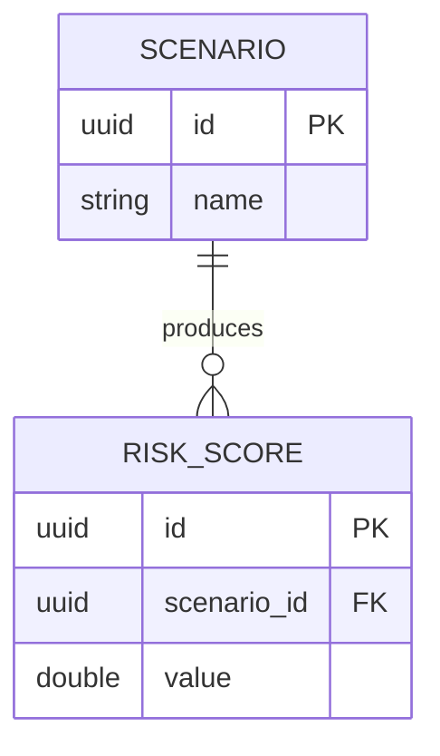

# ER Diagram

The persistence data model: tables, columns, and the relations between them.

- Entity and attribute names are the real table and column names.
- Mark keys with `PK` and `FK`. Label every relation with its meaning.

