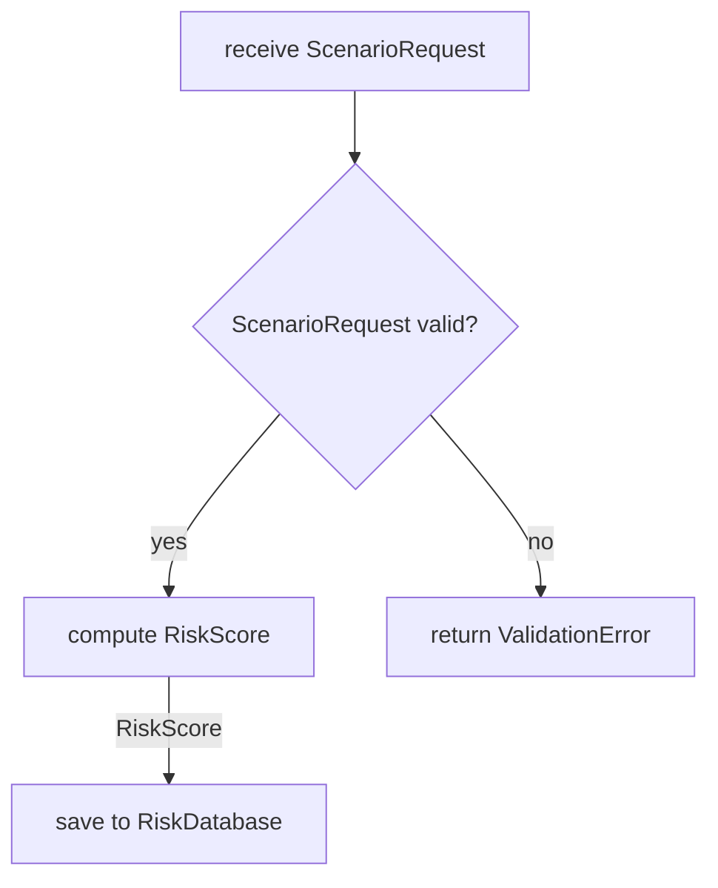

# Flowchart

High-level behavior: the steps of a process or workflow, one action per box.

- Each box is a high-level component or step that performs one action.
- Each arrow has a label with the name of the data element it passes.
- A decision is a `{}` diamond; each outgoing arrow is labelled with its condition.
- Use `flowchart LR` for pipelines and `flowchart TD` for branching processes.
- Use `subgraph` for software layers or isolated systems.

