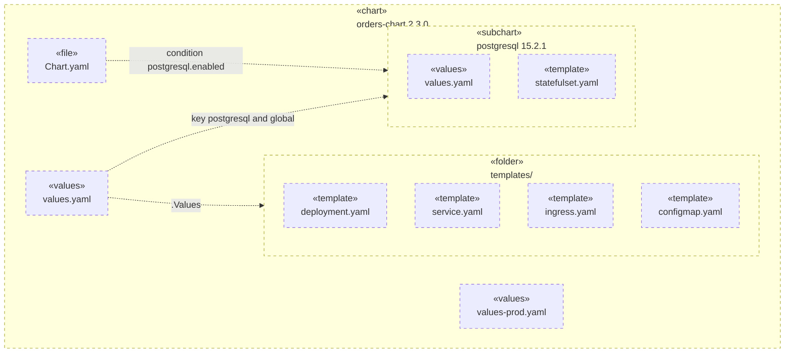
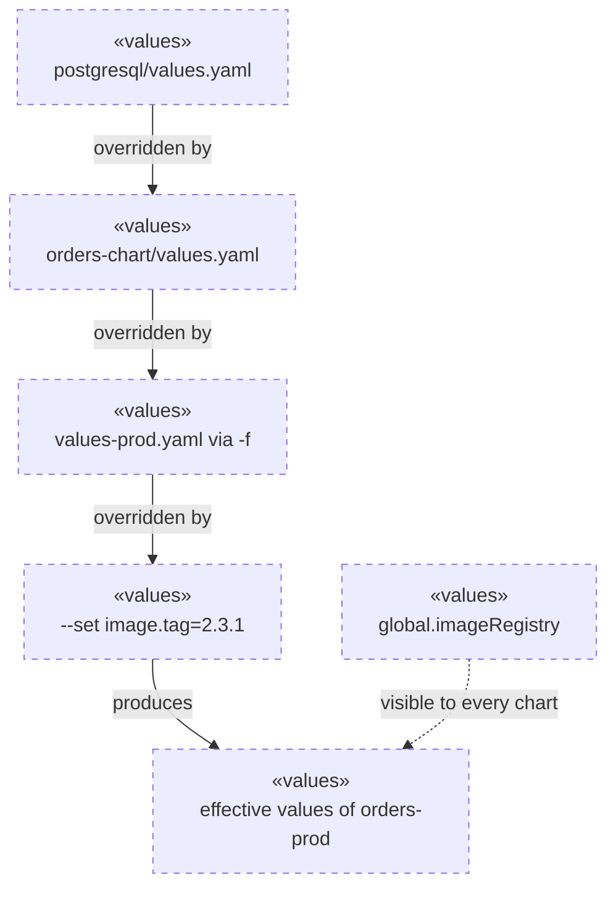
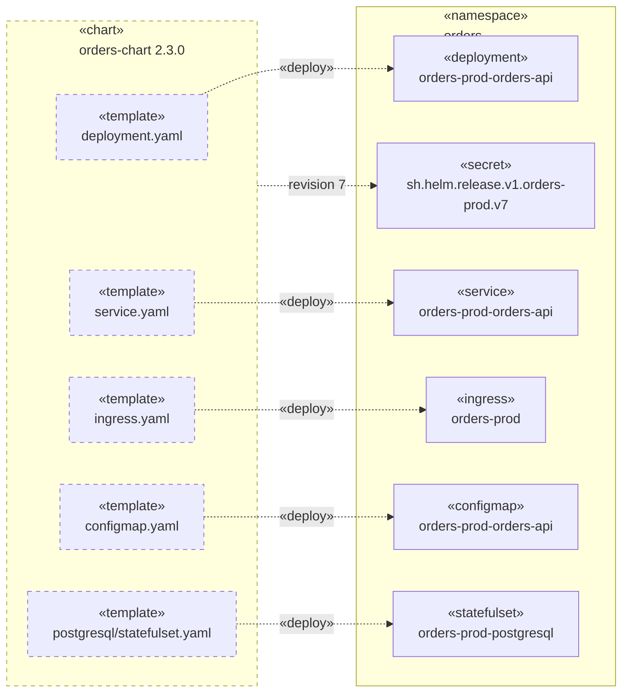
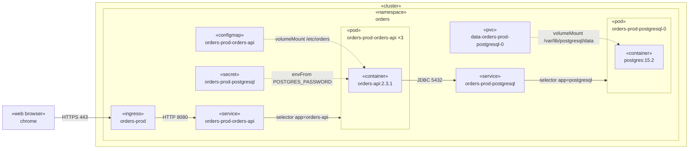
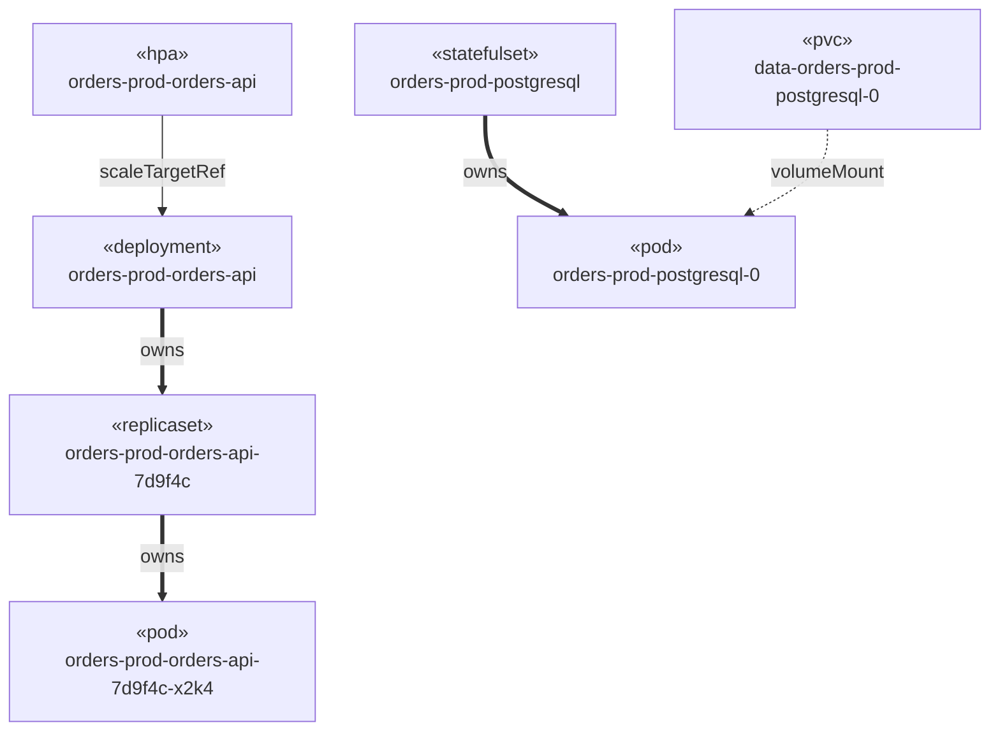

# Kubernetes and Helm Deployment Diagrams

A Helm release spans two worlds: the chart in a repository and the objects in a cluster. Most unreadable Kubernetes
diagrams mix them, or draw ownership, network paths and configuration with the same arrow. Read `deployment.md` first
for the stereotype and border rules; this document specialises them for Kubernetes and Helm.

## Is it an instance or a definition?

If `kubectl get` returns it, it is an instance: solid border. If it lives in a git repository or an image registry, it
is a definition: dashed border.

A `Deployment` object is an instance even though its content is a pod template. It exists in the cluster, it has a
status, and a controller acts on it. The chart, the templates, the values files and the image are the definitions that
produced it.

## Draw one view per question

One diagram cannot answer all five questions below. Pick the question, draw that view, and use only the edge kinds that
belong to it. Never mix ownership arrows with network arrows.

| View              | Question it answers                                             | Side       |
|-------------------|-----------------------------------------------------------------|------------|
| Chart composition | What is in this chart, and which subcharts are switched on?      | definition |
| Value resolution  | Where did the value that reached the container come from?         | definition |
| Release rendering | Which template produced which cluster object?                    | both       |
| Runtime topology  | What runs, and what talks to what?                               | instance   |
| Ownership         | Why does this pod exist, and what does deleting this remove?      | instance   |

Runtime topology is the view a developer needs most often. Draw ownership only for a question about cascading deletion
or about why an object exists; it is the tree `kubectl tree` and the Argo CD resource view print.

## Stereotypes

Use the API kind in lower case as the stereotype, so that a reader can turn any node into a `kubectl get` command.

**Instances - solid border.**

- Cluster scope: `«cluster»`, `«node»`, `«namespace»`, `«crd»`, `«clusterrole»`, `«storageclass»`
- Workloads: `«deployment»`, `«statefulset»`, `«daemonset»`, `«job»`, `«cronjob»`, `«replicaset»`, `«pod»`,
  `«container»`, `«initContainer»`
- Networking: `«service»`, `«ingress»`, `«networkpolicy»`
- Config and storage: `«configmap»`, `«secret»`, `«pvc»`, `«pv»`
- Scaling and identity: `«hpa»`, `«serviceaccount»`, `«role»`

**Definitions - dashed border.**

- `«chart»`, `«subchart»`, `«values»`, `«template»`, `«folder»`, `«file»`, `«image»`, `«rendered manifest»`

## Edges

| Relationship               | Arrow  | Label                                    |
|----------------------------|--------|------------------------------------------|
| Network call               | `-->`  | `HTTPS 443`, `HTTP 8080`, `JDBC 5432`    |
| Service selects pods       | `-->`  | `selector app=orders-api`                |
| Config or storage mounted  | `-.->` | `volumeMount /etc/orders`, `envFrom`     |
| Template produces object   | `-.->` | `«deploy»`                               |
| Value overridden by value  | `-->`  | `overridden by`                          |
| Owner reference            | `==>`  | `owns`                                   |

`==>` is a Kubernetes addition to the arrows in `deployment.md`, because an owner reference is neither a connection nor
data flow.

## Layout

- One `«namespace»` subgraph per namespace. Put cluster-scoped objects in their own subgraph at cluster level.
- `flowchart LR` for network paths, so the request reads left to right. `flowchart TD` for chart trees, value ladders
  and ownership.
- Use the real object names, including the release-name prefix that Helm adds: `orders-prod-orders-api`, not
  `orders-api`. A reader must be able to paste the name into `kubectl`.
- Put replica counts in the label as `×3`. Do not draw identical pods.
- Put the image tag on the container. It is the only thing that links the definition side to the instance side.
- Omit `«replicaset»` from every view except ownership.
- Split at 15 nodes: one diagram per namespace, or one per subchart.

## Values resolution

The value that reaches a container is the result of a merge, and the order is the part developers get wrong. Lowest to
highest precedence:

1. The subchart's own `values.yaml`.
2. The parent chart's `values.yaml`, under a key named after the subchart or its `alias`.
3. Each `-f` / `--values` file, left to right: the rightmost file wins.
4. `--set`, `--set-string`, `--set-file`, `--set-json`.

Two rules constrain the whole picture: a subchart can never read its parent's values, and `global.*` is the only channel
visible to every chart in the tree. A `condition` field in a `Chart.yaml` dependency switches a subchart off entirely,
so label the dependency edge with the condition key.

## Worked example: the orders-prod release

Chart `orders-chart` with a `postgresql` subchart, installed as release `orders-prod` into namespace `orders`.

### 1. Chart composition

What the chart contains, and what turns the subchart on.

### 2. Value resolution

Where the effective value of `postgresql.auth.database` and `image.tag` comes from.

### 3. Release rendering

Which template produced which object. Helm records the result as a Secret in the release namespace.

### 4. Runtime topology

What a request reaches, and where each container reads its configuration.

### 5. Ownership

Why each pod exists, and what a `kubectl delete` of the workload removes. The `«pvc»` has no incoming `owns` edge:
Kubernetes keeps a `volumeClaimTemplates` claim when the StatefulSet is deleted, for data safety, unless
`persistentVolumeClaimRetentionPolicy` says otherwise.

