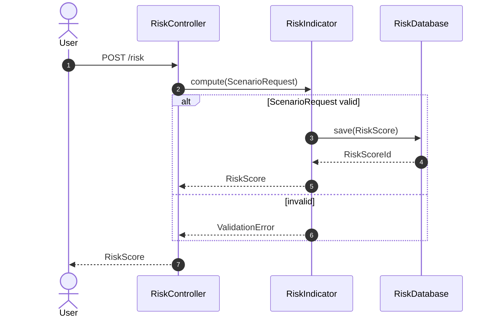

# Sequence Diagram

Low-level behavior: the calls between components in the order they happen.

- Participants are concrete components that exist or will be implemented. Declare them with `participant` in call
  order. Use `actor` only for people.
- Messages are function calls: `A->>B: compute(input)`. Returns use dotted arrows: `B-->>A: RiskScore`.
- Use `alt`/`else`, `opt`, `loop`, and `par` blocks for branches, optional steps, repetition, and parallel steps.
- Add `autonumber` when prose refers to step numbers.

