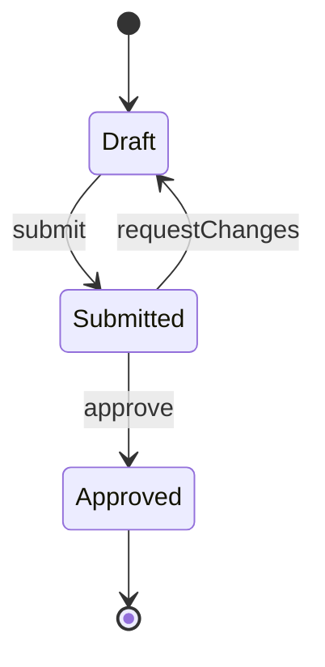

# State Diagram

The lifecycle of one thing: its valid states and the events that move it between them.

- Use `stateDiagram-v2`. Use `[*]` for the start and end states.
- Label every transition with the event that triggers it.
- State names are the values the code stores. A state the code cannot reach does not belong in the diagram.

